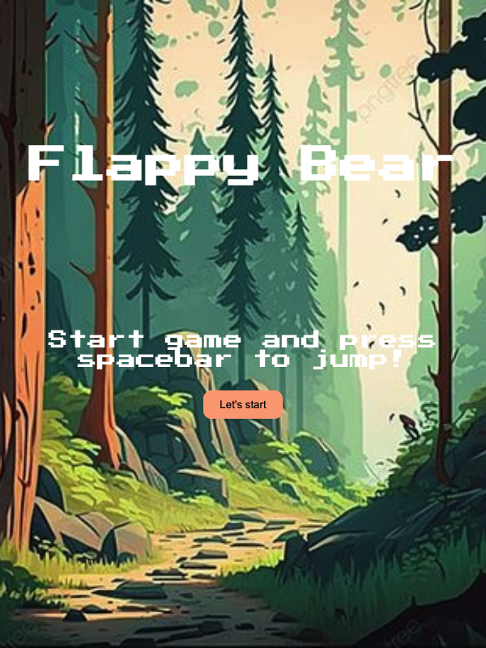
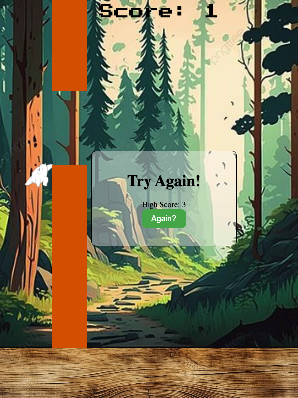

# Flappy Bear

[flappy-bear.vercel.app](flappy-bear.vercel.app)

## Introduction

This game is inspired by the famous casual mobile game, Flappy Bird.
Flappy bird has been around for 11 years now, and at some point of our lives we might have been addicted to playing it.   
With flappy bear, instead of flying we will now have a bear jumping through trees to gain score.  
The player will control the bear with the spacebar and maneuvere through the trees that has random heights.  
Gravity acts on the bear, it automatically falls once game has started and would only jump when the spacebar is release!
The game will continue through until a collision of tree or ground is detected.  

## Actual Game Images

**Start Page**

**Game over Page**

## Technologies Used

Javascript, HTML and CSS

## Getting Started

To get the game started, click on let's start button. Press and release spacebar such that the bear will jump through the gaps in the tree.

## Next Steps

- Adding on difficulty level for players to choose
- Different characters to choose from
- Scoreboard for players to log their high scores in
- Adding on audio to make the whole game experience better
